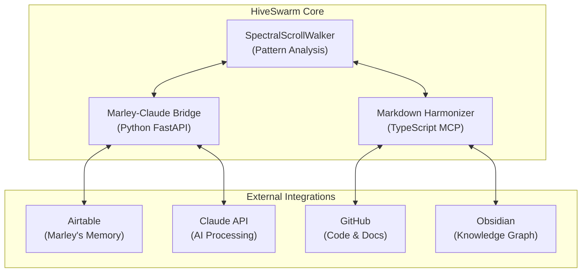

# ClaudeCode HiveSwarm V2 🌀

[](https://opensource.org/licenses/MIT)
[](https://www.typescriptlang.org/)
[](https://python.org)
[](https://docs.docker.com/compose/)

**Multi-agentic markdown harmonization and memory synchronization swarm** that bridges cognitive architectures through intelligent content processing and spectral alignment algorithms.

## ✨ Core Features

- 🧠 **Marley ↔ Claude Memory Bridge**: Bidirectional synchronization between Airtable-based memory and Claude's cognitive processes
- 📝 **Markdown Dialect Harmonizer**: Cross-platform conversion between Obsidian, GitHub, Hugo, and Pandoc formats
- ⚡ **SpectralScrollWalker Integration**: Advanced pattern analysis for content resonance and structural alignment
- 🔗 **Multi-Platform Sync**: Seamless integration between GitHub, Obsidian, and Airtable ecosystems
- 🐳 **Containerized Architecture**: Full Docker Compose orchestration for development and deployment
- 🌐 **MCP Server Integration**: Model Context Protocol servers for enhanced AI interactions

## 🏗️ Architecture Overview



## 🚀 Quick Start

### Prerequisites

- Node.js 18+
- Python 3.9+
- Docker & Docker Compose
- Claude API Key
- Airtable API credentials (optional)

### Installation

1. **Clone the repository:**
   ```bash
   git clone https://github.com/IraBond/ClaudeCodeV2-HiveSwarm.git
   cd ClaudeCodeV2-HiveSwarm
   ```

2. **Set up environment:**
   ```bash
   cp .env.template .env
   # Edit .env with your API keys and configuration
   ```

3. **Install dependencies:**
   ```bash
   npm install
   python -m pip install -r requirements.txt
   ```

4. **Start the development environment:**
   ```bash
   # Option 1: Direct development
   npm run dev
   
   # Option 2: Docker Compose
   npm run hive:spawn
   ```

## 📋 Available Scripts

| Command | Description |
|---------|-------------|
| `npm run dev` | Start both MCP server and memory bridge in development mode |
| `npm run dev:mcp` | Start only the Markdown MCP server |
| `npm run dev:memory` | Start only the Python memory bridge |
| `npm run build` | Build TypeScript and compile Python |
| `npm run test` | Run the test suite |
| `npm run lint:md` | Lint markdown files |
| `npm run spectral:align` | Run SpectralScrollWalker pattern analysis |
| `npm run hive:spawn` | Launch full Docker Compose environment |

## 🔧 Configuration

### Environment Variables

Copy `.env.template` to `.env` and configure:

```env
# Airtable (Marley's Memory)
AIRTABLE_API_KEY=your_key_here
AIRTABLE_BASE_ID=your_base_id
AIRTABLE_TABLE_NAME=MarleyMemory

# Claude API
CLAUDE_API_KEY=your_claude_key

# Development
NODE_ENV=development
DEBUG=true
```

### Docker Services

The system runs three main services:

- **hive-core** (Port 3000): Main application container
- **markdown-mcp** (Port 3001): Markdown harmonization MCP server 
- **memory-sync** (Port 8081): Marley-Claude memory bridge

## 🧠 Memory Synchronization

The Marley-Claude bridge enables bidirectional memory sync:

```python
# Example: Sync memory and analyze patterns
bridge = MarleyClaudeBridge()
result = await bridge.sync_memory_bidirectional()
resonance_map = await bridge.get_memory_resonance_map()
```

**Features:**
- Automatic spectral frequency calculation
- Resonance thread extraction from wikilinks
- Harmonization status tracking
- Cross-platform content alignment

## 📝 Markdown Harmonization

Convert between markdown dialects seamlessly:

```typescript
// Example: Harmonize Obsidian content for GitHub
const result = await harmonizer.harmonizeContent({
  content: "[[My Note]] with #tags",
  sourceDialect: 'obsidian',
  targetDialect: 'github',
  preserveWikilinks: false
});
```

**Supported Dialects:**
- Obsidian (wikilinks, tags, callouts)
- GitHub (task lists, mentions, code blocks)
- Hugo (shortcodes, front matter)
- Pandoc (citations, divs, footnotes)

## 🔬 SpectralScrollWalker

Advanced pattern analysis for content alignment:

- **Spectral Frequency**: Structural complexity measurement
- **Resonance Threads**: Linked concept extraction
- **Harmonization Status**: Content synchronization state
- **Connection Density**: Cross-reference analysis

## 🛠️ Development

### Project Structure

```
ClaudeCodeV2-HiveSwarm/
├── src/
│   ├── mcp-servers/          # MCP server implementations
│   │   └── markdown-server.ts # Markdown harmonization server
│   └── memory-sync/           # Python memory bridge
│       └── marley_claude_bridge.py
├── docs/                      # Documentation
├── config/                    # Configuration files
├── tests/                     # Test suites
└── docker-compose.yml         # Container orchestration
```

### Running Tests

```bash
npm test                 # JavaScript/TypeScript tests
pytest                   # Python tests
npm run lint:md          # Markdown linting
```

### API Endpoints

**Memory Bridge (Port 8080):**
- `POST /api/memory/sync` - Synchronize memory bidirectionally
- `POST /api/spectral/analyze` - Analyze content patterns
- `WS /ws/memory-sync` - Real-time memory synchronization

**MCP Server (Port 3000):**
- `detect_markdown_format` - Identify markdown dialect
- `harmonize_markdown` - Convert between dialects  
- `spectral_alignment` - Analyze document structure

## 🤝 Contributing

1. Fork the repository
2. Create your feature branch (`git checkout -b feature/amazing-feature`)
3. Commit your changes (`git commit -m 'Add amazing feature'`)
4. Push to the branch (`git push origin feature/amazing-feature`)
5. Open a Pull Request

## 📄 License

This project is licensed under the MIT License - see the [LICENSE](LICENSE) file for details.

## 🙏 Acknowledgments

- **Claude AI** for cognitive processing capabilities
- **Marley** for memory architecture inspiration
- **MCP Protocol** for standardized AI interactions
- **SpectralScrollWalker** for pattern analysis algorithms

---

**Made with 🌀 by the HiveSwarm collective**
