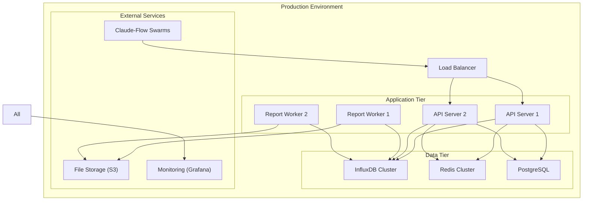

# Claude-Flow Performance Reporting System Architecture

## Overview

The Performance Reporting System is a comprehensive solution for collecting, analyzing, and visualizing performance metrics from claude-flow swarm operations. It provides multiple output formats, comparison capabilities, and seamless CLI integration.

## System Architecture

```mermaid
graph TB
    subgraph "Performance Reporting System"
        PC["PerformanceCollector<br/>(Metrics Ingestion)"]
        MA["MetricsAnalyzer<br/>(Data Processing)"]
        CE["ComparisonEngine<br/>(Swarm Comparison)"]
        RG["ReportGenerator<br/>(Output Formatting)"]
        VR["VisualizationRenderer<br/>(Charts & Graphs)"]
    end
    
    subgraph "Data Storage Layer"
        MDB["MetricsDatabase<br/>(TimeSeries)"]
        RDB["ReportsDatabase<br/>(Generated Reports)"]
        CDC["ConfigDataCache<br/>(Settings)"]
    end
    
    subgraph "Claude-Flow Integration"
        SA["Swarm Agents"]
        SC["Swarm Coordinator"]
        MH["Memory Handler"]
        NH["Neural Handler"]
    end
    
    subgraph "Output Interfaces"
        CLI["CLI Commands"]
        JSON["JSON Export"]
        HTML["HTML Reports"]
        MD["Markdown Reports"]
    end
    
    SA --> PC
    SC --> PC
    MH --> PC
    NH --> PC
    
    PC --> MDB
    PC --> MA
    
    MA --> CE
    MA --> RG
    MA --> VR
    
    CE --> RG
    VR --> RG
    
    RG --> RDB
    RG --> JSON
    RG --> HTML
    RG --> MD
    
    CLI --> RG
    CLI --> CE
    CLI --> VR
    
    MDB <--> MA
    RDB <--> RG
    CDC <--> All Components
```

## Core Components

### 1. PerformanceCollector

**Purpose**: Gathers real-time metrics from swarm operations

**Key Features**:
- Real-time metric collection from swarm agents
- Minimal performance overhead
- Configurable collection intervals
- Automatic error handling and retry logic
- Support for custom metric definitions

**Data Collection Points**:
- Task execution times
- Agent spawn/termination events
- Memory usage patterns
- Network communication metrics
- Neural pattern processing times
- Error rates and failure modes
- Resource utilization (CPU, memory, I/O)

### 2. MetricsAnalyzer

**Purpose**: Processes raw metrics into actionable insights

**Key Features**:
- Statistical analysis (percentiles, averages, distributions)
- Trend detection and anomaly identification
- Performance pattern recognition
- Predictive performance modeling
- Custom analysis pipeline support

**Analysis Capabilities**:
- Time-series analysis
- Correlation analysis between metrics
- Performance regression detection
- Bottleneck identification
- Efficiency scoring algorithms

### 3. ComparisonEngine

**Purpose**: Enables detailed comparison between different swarm configurations

**Key Features**:
- Multi-dimensional comparison matrices
- A/B testing support
- Historical comparison capabilities
- Configuration impact analysis
- Performance delta calculations

**Comparison Types**:
- Swarm topology comparisons
- Agent configuration comparisons
- Task complexity impact analysis
- Temporal performance evolution
- Resource allocation efficiency

### 4. ReportGenerator

**Purpose**: Creates formatted reports in multiple output formats

**Supported Formats**:
- **JSON**: Machine-readable data for integration
- **HTML**: Interactive web-based reports with embedded visualizations
- **Markdown**: Documentation-friendly format with tables and charts
- **PDF**: Print-ready comprehensive reports (future enhancement)

**Report Types**:
- Executive summaries
- Detailed technical reports
- Comparison reports
- Real-time dashboards
- Historical trend reports

### 5. VisualizationRenderer

**Purpose**: Creates charts, graphs, and visual representations of performance data

**Visualization Types**:
- Time-series line charts
- Performance heatmaps
- Distribution histograms
- Scatter plots for correlation analysis
- Network topology visualizations
- Interactive performance dashboards

**Technology Stack**:
- Chart.js for web-based visualizations
- D3.js for complex interactive charts
- ASCII charts for CLI output
- SVG generation for report embedding

## Data Architecture

### Performance Metrics Schema

```typescript
interface PerformanceMetric {
  id: string;
  timestamp: number;
  swarmId: string;
  agentId?: string;
  metricType: MetricType;
  value: number | object;
  unit: string;
  tags: Record<string, string>;
  metadata: MetricMetadata;
}

interface MetricMetadata {
  source: 'agent' | 'coordinator' | 'memory' | 'neural';
  priority: 'high' | 'medium' | 'low';
  category: 'performance' | 'resource' | 'error' | 'business';
  dimensions: string[];
}

enum MetricType {
  TASK_DURATION = 'task_duration',
  MEMORY_USAGE = 'memory_usage',
  CPU_USAGE = 'cpu_usage',
  NETWORK_LATENCY = 'network_latency',
  ERROR_RATE = 'error_rate',
  THROUGHPUT = 'throughput',
  AGENT_SPAWN_TIME = 'agent_spawn_time',
  NEURAL_PROCESSING_TIME = 'neural_processing_time'
}
```

### Report Configuration Schema

```typescript
interface ReportConfig {
  id: string;
  name: string;
  description: string;
  outputFormat: 'json' | 'html' | 'markdown';
  timeRange: TimeRange;
  metrics: MetricSelector[];
  visualizations: VisualizationConfig[];
  filters: ReportFilter[];
  schedule?: ScheduleConfig;
}

interface TimeRange {
  start: number;
  end: number;
  granularity: 'second' | 'minute' | 'hour' | 'day';
}

interface MetricSelector {
  metricType: MetricType;
  aggregation: 'sum' | 'avg' | 'min' | 'max' | 'p95' | 'p99';
  groupBy: string[];
}
```

## Integration Points

### Claude-Flow Command Integration

The performance reporting system integrates seamlessly with existing claude-flow commands:

```bash
# Basic performance reporting
npx claude-flow perf report --format json --output performance-report.json

# Real-time monitoring
npx claude-flow perf monitor --swarm-id "swarm-123" --live

# Compare swarms
npx claude-flow perf compare --swarms "swarm-123,swarm-456" --format html

# Generate historical analysis
npx claude-flow perf analyze --time-range "last-7-days" --format markdown
```

### MCP Server Integration

```typescript
// New MCP tools for performance reporting
{
  name: 'collect_performance_metrics',
  description: 'Collect performance metrics from swarm operations',
  inputSchema: {
    type: 'object',
    properties: {
      swarmId: { type: 'string' },
      duration: { type: 'number' },
      metrics: { type: 'array', items: { type: 'string' } }
    }
  }
},
{
  name: 'generate_performance_report',
  description: 'Generate formatted performance report',
  inputSchema: {
    type: 'object',
    properties: {
      config: { type: 'object' },
      format: { type: 'string', enum: ['json', 'html', 'markdown'] }
    }
  }
}
```

### API Endpoints

```typescript
// RESTful API for external integrations
interface PerformanceAPI {
  // Metrics collection
  POST /api/v1/metrics/collect
  GET /api/v1/metrics/query
  
  // Report generation
  POST /api/v1/reports/generate
  GET /api/v1/reports/{reportId}
  
  // Comparisons
  POST /api/v1/compare/swarms
  GET /api/v1/compare/{comparisonId}
  
  // Real-time streaming
  WS /ws/metrics/stream
  WS /ws/reports/live
}
```

## Implementation Architecture

### Component Interfaces

```typescript
interface IPerformanceCollector {
  start(): Promise<void>;
  stop(): Promise<void>;
  collect(swarmId: string): Promise<PerformanceMetric[]>;
  configure(config: CollectorConfig): void;
  subscribe(callback: MetricCallback): void;
}

interface IMetricsAnalyzer {
  analyze(metrics: PerformanceMetric[]): Promise<AnalysisResult>;
  detectAnomalies(metrics: PerformanceMetric[]): Promise<Anomaly[]>;
  predictTrends(metrics: PerformanceMetric[]): Promise<TrendPrediction>;
  generateInsights(analysis: AnalysisResult): Promise<Insight[]>;
}

interface IComparisonEngine {
  compare(swarms: SwarmMetrics[]): Promise<ComparisonResult>;
  benchmark(baseline: SwarmMetrics, candidates: SwarmMetrics[]): Promise<BenchmarkResult>;
  rankPerformance(swarms: SwarmMetrics[]): Promise<PerformanceRanking>;
}

interface IReportGenerator {
  generate(config: ReportConfig, data: AnalysisResult): Promise<Report>;
  export(report: Report, format: OutputFormat): Promise<string>;
  schedule(config: ReportConfig): Promise<void>;
}

interface IVisualizationRenderer {
  renderChart(type: ChartType, data: ChartData): Promise<Visualization>;
  renderDashboard(config: DashboardConfig): Promise<Dashboard>;
  exportVisualization(viz: Visualization, format: ExportFormat): Promise<Buffer>;
}
```

### Data Flow Patterns

1. **Collection Flow**:
   - Swarm operations emit events → PerformanceCollector → MetricsDatabase

2. **Analysis Flow**:
   - MetricsDatabase → MetricsAnalyzer → Insights/Anomalies/Trends

3. **Comparison Flow**:
   - Multiple SwarmMetrics → ComparisonEngine → ComparisonResults

4. **Reporting Flow**:
   - AnalysisResult + ComparisonResult + Visualizations → ReportGenerator → Formatted Reports

5. **Real-time Flow**:
   - Live metrics → WebSocket streams → Real-time dashboards

## Quality Attributes

### Performance
- Sub-millisecond metric collection overhead
- Parallel processing of analysis workloads
- Efficient time-series data storage
- Lazy loading of large datasets

### Scalability
- Horizontal scaling of collector instances
- Partitioned metrics storage
- Asynchronous report generation
- Configurable retention policies

### Reliability
- Fault-tolerant metric collection
- Graceful degradation during high load
- Automatic retry mechanisms
- Data validation and sanitization

### Security
- Encrypted metrics transmission
- Role-based access to reports
- Secure API authentication
- Data anonymization options

### Maintainability
- Modular component architecture
- Comprehensive logging and monitoring
- Configuration-driven behavior
- Extensive test coverage

## Technology Stack

### Backend Services
- **TypeScript/Node.js**: Core service implementation
- **InfluxDB**: Time-series metrics storage
- **Redis**: Caching and session management
- **PostgreSQL**: Report metadata and configurations

### Visualization & Frontend
- **Chart.js**: Standard charting library
- **D3.js**: Advanced interactive visualizations
- **React**: Web dashboard interface
- **Tailwind CSS**: Responsive styling

### Integration & Communication
- **WebSocket**: Real-time data streaming
- **Express.js**: REST API endpoints
- **Bull Queue**: Asynchronous job processing
- **Docker**: Containerized deployments

## Deployment Architecture



## Future Enhancements

### Phase 2 Features
- Machine learning-powered performance prediction
- Automated performance optimization suggestions
- Integration with external monitoring systems (Prometheus, Grafana)
- Advanced alerting and notification system

### Phase 3 Features
- Multi-tenant performance isolation
- Cost optimization analysis
- Integration with cloud provider metrics
- Advanced natural language report generation

This architecture provides a robust foundation for comprehensive performance monitoring and reporting of claude-flow swarm operations, with clear separation of concerns, scalable design patterns, and extensive integration capabilities.