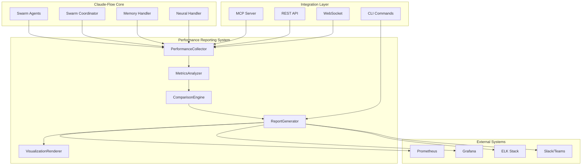

# Claude-Flow Performance Reporting System - Integration Guide

## Overview

This document provides comprehensive guidance for integrating the Performance Reporting System with existing claude-flow infrastructure and external systems.

## Integration Architecture



## MCP Server Integration

### Performance Reporting MCP Tools

Add these tools to your existing MCP server implementation:

```typescript
// In your existing MCP server
import { PerformanceReportingSystem, createPerformanceReportingSystem } from './src/performance-reporting/index.js';

class ClaudeFlowMCPServer {
  private performanceSystem: PerformanceReportingSystem;
  
  constructor() {
    this.performanceSystem = createPerformanceReportingSystem({
      collector: {
        interval: 3000,
        sources: ['agent', 'coordinator', 'neural']
      }
    });
  }

  async initialize() {
    await this.performanceSystem.initialize();
    this.setupPerformanceTools();
  }

  private setupPerformanceTools() {
    // Collect performance metrics
    this.server.setRequestHandler('tools/call', async (request) => {
      const { name, arguments: args } = request.params;
      
      if (name === 'collect_performance_metrics') {
        const { swarmId, duration = 10000 } = args;
        const metrics = await this.performanceSystem.components.collector.collect(swarmId, duration);
        
        return {
          content: [{
            type: 'text',
            text: JSON.stringify({
              metricsCollected: metrics.length,
              swarmId,
              timestamp: Date.now(),
              metrics: metrics.slice(0, 10) // Show first 10 for brevity
            }, null, 2)
          }]
        };
      }

      if (name === 'analyze_performance') {
        const { swarmId } = args;
        const report = await this.performanceSystem.getQuickReport(swarmId);
        
        return {
          content: [{
            type: 'text',
            text: JSON.stringify(report, null, 2)
          }]
        };
      }

      if (name === 'compare_swarms') {
        const { swarmIds } = args;
        const swarms = [];
        
        for (const swarmId of swarmIds) {
          const metrics = await this.performanceSystem.components.collector.collect(swarmId);
          swarms.push({
            swarmId,
            startTime: Date.now() - 3600000,
            endTime: Date.now(),
            metrics,
            configuration: { topology: 'mesh', agentCount: 3, agentTypes: ['coder', 'reviewer'], memoryConfig: {}, neuralConfig: {}, customSettings: {} },
            summary: { totalTasks: metrics.length, successRate: 0.95, avgExecutionTime: 500, peakMemoryUsage: 0.6, errorCount: 2, tokenConsumption: 1500 }
          });
        }
        
        const comparison = await this.performanceSystem.components.comparisonEngine.compare(swarms);
        
        return {
          content: [{
            type: 'text',
            text: JSON.stringify({
              winner: comparison.overallWinner,
              rankings: comparison.swarms.map(s => ({ swarm: s.swarmId, rank: s.rank, score: s.score })),
              recommendations: comparison.recommendations.slice(0, 3)
            }, null, 2)
          }]
        };
      }

      if (name === 'generate_performance_report') {
        const { swarmId, format = 'markdown' } = args;
        const metrics = await this.performanceSystem.components.collector.collect(swarmId);
        const analysis = await this.performanceSystem.components.analyzer.analyze(metrics);
        
        const reportConfig = {
          id: `mcp_report_${Date.now()}`,
          name: `Performance Report - ${swarmId}`,
          description: `MCP-generated performance report for ${swarmId}`,
          outputFormat: format,
          timeRange: { start: Date.now() - 3600000, end: Date.now(), granularity: 'minute' as const },
          metrics: [
            { metricType: 'TASK_DURATION' as const, aggregation: 'avg' as const, groupBy: ['swarmId'] },
            { metricType: 'ERROR_RATE' as const, aggregation: 'avg' as const, groupBy: ['swarmId'] }
          ],
          visualizations: [],
          filters: []
        };
        
        const report = await this.performanceSystem.components.reportGenerator.generate(reportConfig, analysis);
        const output = await this.performanceSystem.components.reportGenerator.export(report, format as any);
        
        return {
          content: [{
            type: 'text',
            text: output
          }]
        };
      }

      if (name === 'system_health_check') {
        const health = this.performanceSystem.getSystemHealth();
        
        return {
          content: [{
            type: 'text',
            text: JSON.stringify({
              status: health.overall,
              components: health.components,
              uptime: Math.floor(health.uptime / 1000) + ' seconds',
              metricsCollected: health.metrics.metricsCollected,
              lastCollection: health.metrics.lastCollection ? new Date(health.metrics.lastCollection).toISOString() : 'Never'
            }, null, 2)
          }]
        };
      }
    });

    // Register the new tools
    this.server.setRequestHandler('tools/list', async () => {
      const existingTools = await this.getExistingTools();
      
      return {
        tools: [
          ...existingTools,
          {
            name: 'collect_performance_metrics',
            description: 'Collect performance metrics from a swarm',
            inputSchema: {
              type: 'object',
              properties: {
                swarmId: { type: 'string', description: 'ID of the swarm to collect metrics from' },
                duration: { type: 'number', description: 'Collection duration in milliseconds' }
              },
              required: ['swarmId']
            }
          },
          {
            name: 'analyze_performance',
            description: 'Generate quick performance analysis for a swarm',
            inputSchema: {
              type: 'object',
              properties: {
                swarmId: { type: 'string', description: 'ID of the swarm to analyze' }
              },
              required: ['swarmId']
            }
          },
          {
            name: 'compare_swarms',
            description: 'Compare performance between multiple swarms',
            inputSchema: {
              type: 'object',
              properties: {
                swarmIds: { 
                  type: 'array', 
                  items: { type: 'string' },
                  description: 'Array of swarm IDs to compare'
                }
              },
              required: ['swarmIds']
            }
          },
          {
            name: 'generate_performance_report',
            description: 'Generate a formatted performance report',
            inputSchema: {
              type: 'object',
              properties: {
                swarmId: { type: 'string', description: 'ID of the swarm to report on' },
                format: { 
                  type: 'string', 
                  enum: ['json', 'html', 'markdown'],
                  description: 'Output format for the report'
                }
              },
              required: ['swarmId']
            }
          },
          {
            name: 'system_health_check',
            description: 'Check the health status of the performance reporting system',
            inputSchema: {
              type: 'object',
              properties: {},
              required: []
            }
          }
        ]
      };
    });
  }
}
```

## CLI Integration

### Extended Claude-Flow Commands

Add performance reporting commands to your existing claude-flow CLI:

```bash
# Performance monitoring
npx claude-flow perf monitor start --swarm "swarm-123" --live
npx claude-flow perf monitor stop
npx claude-flow perf status

# Report generation  
npx claude-flow perf report generate --swarm "swarm-123" --format html --output report.html
npx claude-flow perf report schedule --frequency daily --swarms "swarm-1,swarm-2" --recipients "team@company.com"

# Swarm comparison
npx claude-flow perf compare swarms --swarms "swarm-1,swarm-2,swarm-3" --format json
npx claude-flow perf compare benchmark --baseline "swarm-1" --candidates "swarm-2,swarm-3"
npx claude-flow perf compare rank --swarms "swarm-1,swarm-2,swarm-3" --format table

# Visualization
npx claude-flow perf visualize chart --swarm "swarm-123" --metric "TASK_DURATION" --type line
npx claude-flow perf visualize dashboard --config dashboard.json --serve --port 8080
```

### Custom CLI Configuration

Create a configuration file `performance-config.json`:

```json
{
  "collector": {
    "enabled": true,
    "interval": 5000,
    "batchSize": 100,
    "sources": ["agent", "coordinator", "memory", "neural"],
    "sampling": {
      "enabled": true,
      "rate": 0.8,
      "strategy": "priority"
    }
  },
  "analyzer": {
    "enabled": true,
    "anomalyDetection": {
      "enabled": true,
      "sensitivity": 2.0,
      "methods": ["zscore", "iqr"]
    },
    "trendAnalysis": {
      "enabled": true,
      "methods": ["linear", "exponential"],
      "predictionHorizon": 600000
    }
  },
  "reporting": {
    "defaultFormat": "html",
    "autoGenerate": true,
    "schedule": {
      "dailyReport": {
        "frequency": "daily",
        "time": "09:00",
        "recipients": ["team@company.com"],
        "swarms": ["production-swarm-1", "production-swarm-2"]
      }
    }
  },
  "visualization": {
    "defaultTheme": "light",
    "colorScheme": "performance",
    "enableInteractivity": true
  }
}
```

## REST API Integration

### API Endpoints

```typescript
import express from 'express';
import { createPerformanceReportingSystem } from './src/performance-reporting/index.js';

const app = express();
const performanceSystem = createPerformanceReportingSystem();

// Initialize system
app.listen(3001, async () => {
  await performanceSystem.initialize();
  console.log('Performance API server running on port 3001');
});

// Metrics endpoints
app.get('/api/v1/metrics/:swarmId', async (req, res) => {
  try {
    const { swarmId } = req.params;
    const { duration = 30000 } = req.query;
    
    const metrics = await performanceSystem.components.collector.collect(swarmId, Number(duration));
    res.json({ metrics, count: metrics.length });
  } catch (error) {
    res.status(500).json({ error: error.message });
  }
});

// Analysis endpoints
app.get('/api/v1/analysis/:swarmId', async (req, res) => {
  try {
    const report = await performanceSystem.getQuickReport(req.params.swarmId);
    res.json(report);
  } catch (error) {
    res.status(500).json({ error: error.message });
  }
});

// Comparison endpoints
app.post('/api/v1/compare', async (req, res) => {
  try {
    const { swarmIds, baseline } = req.body;
    
    const swarms = [];
    for (const swarmId of swarmIds) {
      const metrics = await performanceSystem.components.collector.collect(swarmId);
      swarms.push({
        swarmId,
        startTime: Date.now() - 3600000,
        endTime: Date.now(),
        metrics,
        configuration: { topology: 'mesh', agentCount: 3, agentTypes: [], memoryConfig: {}, neuralConfig: {}, customSettings: {} },
        summary: { totalTasks: 0, successRate: 1, avgExecutionTime: 0, peakMemoryUsage: 0, errorCount: 0, tokenConsumption: 0 }
      });
    }
    
    const result = baseline 
      ? await performanceSystem.components.comparisonEngine.benchmark(
          swarms.find(s => s.swarmId === baseline)!,
          swarms.filter(s => s.swarmId !== baseline)
        )
      : await performanceSystem.components.comparisonEngine.compare(swarms);
    
    res.json(result);
  } catch (error) {
    res.status(500).json({ error: error.message });
  }
});

// Report generation endpoints
app.post('/api/v1/reports', async (req, res) => {
  try {
    const { swarmId, format = 'json', config } = req.body;
    
    const metrics = await performanceSystem.components.collector.collect(swarmId);
    const analysis = await performanceSystem.components.analyzer.analyze(metrics);
    
    const reportConfig = {
      id: `api_report_${Date.now()}`,
      name: `API Report - ${swarmId}`,
      description: `Generated via API for ${swarmId}`,
      outputFormat: format,
      timeRange: { start: Date.now() - 3600000, end: Date.now(), granularity: 'minute' as const },
      metrics: [],
      visualizations: [],
      filters: [],
      ...config
    };
    
    const report = await performanceSystem.components.reportGenerator.generate(reportConfig, analysis);
    const output = await performanceSystem.components.reportGenerator.export(report, format);
    
    res.type(format === 'html' ? 'text/html' : 'application/json').send(output);
  } catch (error) {
    res.status(500).json({ error: error.message });
  }
});

// System health endpoint
app.get('/api/v1/health', (req, res) => {
  const health = performanceSystem.getSystemHealth();
  res.json(health);
});

// WebSocket for real-time metrics
import { WebSocketServer } from 'ws';

const wss = new WebSocketServer({ port: 3002 });

wss.on('connection', (ws) => {
  console.log('Client connected to performance stream');
  
  // Subscribe to metric batches
  const handler = (event: any) => {
    ws.send(JSON.stringify({
      type: 'metrics_batch',
      data: {
        count: event.count,
        timestamp: event.timestamp,
        preview: event.metrics.slice(0, 5)
      }
    }));
  };
  
  performanceSystem.components.collector.on('metrics:batch', handler);
  
  ws.on('close', () => {
    performanceSystem.components.collector.removeListener('metrics:batch', handler);
    console.log('Client disconnected from performance stream');
  });
});
```

## External System Integrations

### Prometheus Integration

```typescript
import client from 'prom-client';

// Create custom metrics
const taskDurationHistogram = new client.Histogram({
  name: 'claude_flow_task_duration_seconds',
  help: 'Task execution duration in seconds',
  labelNames: ['swarm_id', 'agent_id', 'task_type'],
  buckets: [0.1, 0.5, 1, 2, 5, 10]
});

const errorRateGauge = new client.Gauge({
  name: 'claude_flow_error_rate',
  help: 'Error rate percentage',
  labelNames: ['swarm_id']
});

const memoryUsageGauge = new client.Gauge({
  name: 'claude_flow_memory_usage_ratio',
  help: 'Memory usage ratio (0-1)',
  labelNames: ['swarm_id', 'agent_id']
});

// Integration function
function setupPrometheusIntegration(performanceSystem: PerformanceReportingSystem) {
  performanceSystem.components.collector.on('metrics:batch', (event) => {
    for (const metric of event.metrics) {
      switch (metric.metricType) {
        case 'TASK_DURATION':
          taskDurationHistogram
            .labels(metric.swarmId, metric.agentId || 'unknown', 'general')
            .observe(Number(metric.value) / 1000); // Convert to seconds
          break;
        
        case 'ERROR_RATE':
          errorRateGauge
            .labels(metric.swarmId)
            .set(Number(metric.value));
          break;
        
        case 'MEMORY_USAGE':
          memoryUsageGauge
            .labels(metric.swarmId, metric.agentId || 'unknown')
            .set(Number(metric.value));
          break;
      }
    }
  });
}
```

### Slack Integration

```typescript
import { WebClient } from '@slack/web-api';

class SlackIntegration {
  private slack: WebClient;
  
  constructor(token: string) {
    this.slack = new WebClient(token);
  }
  
  async setupAlerts(performanceSystem: PerformanceReportingSystem) {
    // Alert on critical anomalies
    performanceSystem.components.collector.on('analysis:completed', async (event) => {
      const criticalAnomalies = event.analysis.anomalies.filter(a => a.severity === 'critical');
      
      if (criticalAnomalies.length > 0) {
        await this.sendAlert({
          channel: '#claude-flow-alerts',
          title: `🚨 Critical Performance Issues Detected`,
          swarmId: event.swarmId,
          anomalies: criticalAnomalies,
          timestamp: event.timestamp
        });
      }
    });
    
    // Daily performance summary
    setInterval(async () => {
      const health = performanceSystem.getSystemHealth();
      await this.sendDailySummary(health);
    }, 24 * 60 * 60 * 1000); // Daily
  }
  
  private async sendAlert(alert: any) {
    const message = this.formatAlertMessage(alert);
    
    await this.slack.chat.postMessage({
      channel: alert.channel,
      text: message.text,
      attachments: message.attachments
    });
  }
  
  private async sendDailySummary(health: any) {
    await this.slack.chat.postMessage({
      channel: '#claude-flow-status',
      text: `📊 Daily Performance Summary`,
      attachments: [{
        color: health.overall === 'healthy' ? 'good' : 'danger',
        fields: [
          { title: 'System Health', value: health.overall, short: true },
          { title: 'Metrics Collected', value: health.metrics.metricsCollected.toString(), short: true },
          { title: 'Error Count', value: health.metrics.errorCount.toString(), short: true },
          { title: 'Uptime', value: Math.floor(health.uptime / 1000 / 60) + ' minutes', short: true }
        ]
      }]
    });
  }
  
  private formatAlertMessage(alert: any) {
    return {
      text: alert.title,
      attachments: [{
        color: 'danger',
        title: `Swarm: ${alert.swarmId}`,
        fields: alert.anomalies.map(anomaly => ({
          title: anomaly.metricType,
          value: anomaly.description,
          short: false
        })),
        footer: 'Claude-Flow Performance System',
        ts: Math.floor(alert.timestamp / 1000)
      }]
    };
  }
}
```

### ELK Stack Integration

```typescript
import { Client } from '@elastic/elasticsearch';

class ElasticsearchIntegration {
  private client: Client;
  
  constructor(endpoint: string) {
    this.client = new Client({ node: endpoint });
  }
  
  async setupLogging(performanceSystem: PerformanceReportingSystem) {
    // Create index template
    await this.createIndexTemplate();
    
    // Log all metrics to Elasticsearch
    performanceSystem.components.collector.on('metrics:batch', async (event) => {
      const documents = event.metrics.map(metric => ({
        ...metric,
        '@timestamp': new Date(metric.timestamp).toISOString(),
        event_type: 'metric'
      }));
      
      await this.bulkIndex('claude-flow-metrics', documents);
    });
    
    // Log analysis results
    performanceSystem.components.collector.on('analysis:completed', async (event) => {
      await this.indexDocument('claude-flow-analysis', {
        ...event.analysis,
        '@timestamp': new Date(event.timestamp).toISOString(),
        swarm_id: event.swarmId,
        event_type: 'analysis'
      });
    });
  }
  
  private async createIndexTemplate() {
    await this.client.indices.putIndexTemplate({
      name: 'claude-flow-template',
      index_patterns: ['claude-flow-*'],
      template: {
        mappings: {
          properties: {
            '@timestamp': { type: 'date' },
            swarm_id: { type: 'keyword' },
            agent_id: { type: 'keyword' },
            metric_type: { type: 'keyword' },
            value: { type: 'double' },
            unit: { type: 'keyword' },
            event_type: { type: 'keyword' }
          }
        }
      }
    });
  }
  
  private async bulkIndex(index: string, documents: any[]) {
    const body = documents.flatMap(doc => [
      { index: { _index: `${index}-${new Date().toISOString().slice(0, 7)}` } },
      doc
    ]);
    
    await this.client.bulk({ body });
  }
  
  private async indexDocument(index: string, document: any) {
    await this.client.index({
      index: `${index}-${new Date().toISOString().slice(0, 7)}`,
      body: document
    });
  }
}
```

## Deployment Configuration

### Docker Compose Extension

Add to your existing `docker-compose.yml`:

```yaml
services:
  performance-reporting:
    build:
      context: .
      dockerfile: Dockerfile.performance
    ports:
      - "3001:3001"  # REST API
      - "3002:3002"  # WebSocket
    environment:
      - NODE_ENV=production
      - COLLECTOR_INTERVAL=5000
      - ENABLE_PROMETHEUS=true
      - SLACK_TOKEN=${SLACK_TOKEN}
      - ELASTICSEARCH_URL=http://elasticsearch:9200
    depends_on:
      - elasticsearch
      - prometheus
    volumes:
      - ./config/performance-config.json:/app/config/performance-config.json
      - performance-data:/app/data
    networks:
      - claude-flow-network

  prometheus:
    image: prom/prometheus:latest
    ports:
      - "9090:9090"
    volumes:
      - ./config/prometheus.yml:/etc/prometheus/prometheus.yml
      - prometheus-data:/prometheus
    networks:
      - claude-flow-network

  grafana:
    image: grafana/grafana:latest
    ports:
      - "3000:3000"
    environment:
      - GF_SECURITY_ADMIN_PASSWORD=admin
    volumes:
      - grafana-data:/var/lib/grafana
      - ./config/grafana/dashboards:/var/lib/grafana/dashboards
    networks:
      - claude-flow-network

volumes:
  performance-data:
  prometheus-data:
  grafana-data:

networks:
  claude-flow-network:
    external: true
```

### Kubernetes Deployment

```yaml
apiVersion: apps/v1
kind: Deployment
metadata:
  name: claude-flow-performance
  labels:
    app: claude-flow-performance
spec:
  replicas: 2
  selector:
    matchLabels:
      app: claude-flow-performance
  template:
    metadata:
      labels:
        app: claude-flow-performance
    spec:
      containers:
      - name: performance-reporting
        image: claude-flow-performance:1.0.0
        ports:
        - containerPort: 3001
        - containerPort: 3002
        env:
        - name: NODE_ENV
          value: "production"
        - name: COLLECTOR_INTERVAL
          value: "5000"
        - name: SLACK_TOKEN
          valueFrom:
            secretKeyRef:
              name: claude-flow-secrets
              key: slack-token
        resources:
          requests:
            memory: "256Mi"
            cpu: "250m"
          limits:
            memory: "512Mi"
            cpu: "500m"
        readinessProbe:
          httpGet:
            path: /api/v1/health
            port: 3001
          initialDelaySeconds: 10
          periodSeconds: 5
        livenessProbe:
          httpGet:
            path: /api/v1/health
            port: 3001
          initialDelaySeconds: 30
          periodSeconds: 10
---
apiVersion: v1
kind: Service
metadata:
  name: claude-flow-performance-service
spec:
  selector:
    app: claude-flow-performance
  ports:
  - name: http
    port: 3001
    targetPort: 3001
  - name: websocket
    port: 3002
    targetPort: 3002
  type: ClusterIP
```

This integration guide provides comprehensive examples for connecting the Performance Reporting System with existing infrastructure, external monitoring systems, and deployment platforms. The modular design allows for gradual integration and customization based on specific requirements.